# SonarQube detailed instructions

## SonarQube extension for Visual Studio Code

The SonarQube extension for Visual Studio Code is a great tool for developers who want to continuously inspect their code quality. It provides on-the-fly feedback to developers on new bugs, vulnerabilities, and code smells injected into their code. The extension is available for free on the Visual Studio Code Marketplace.

Go to the Visual Studio Code Marketplace and search for SonarQube. Click on the Install button to install the extension.

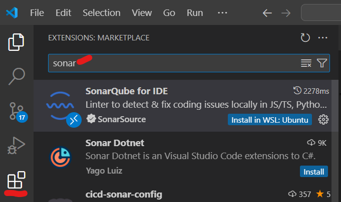

## Configuring the SonarQube connected mode

Once installed, you can configure the SonarQube extension to connect to your SonarQube server. To do this, you need to provide the URL of your SonarQube server and the authentication token.

    NOTE: if you do not have a SonarQube server, you can use the SonarQube Community Edition, which is free and open-source, running on your local machine as a Docker container. Go to this [link](#installing-sonarqube-locally-using-docker) in this doc for more information on how to set up SonarQube locally.

First, go to the SonarQube extension icon on the left sidebar of Visual Studio Code and click on the '+' icon to add a new SonarQube server.

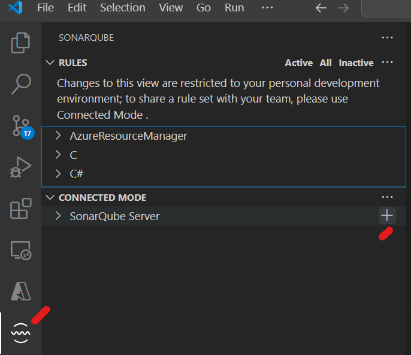

Next, provide the URL of your SonarQube server and the authentication token (this token can be generated by clicking on 'Generate Token'). 

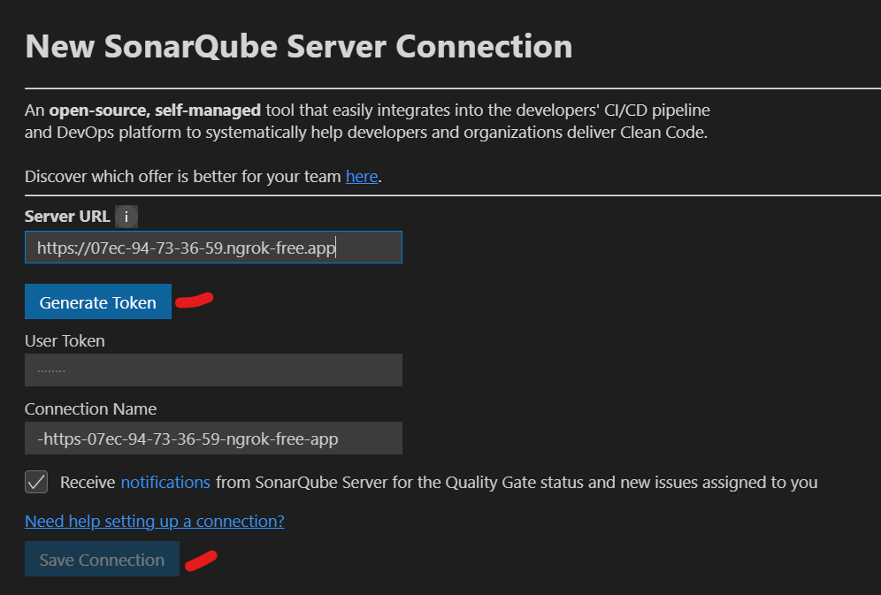

Then, use admin/admin:

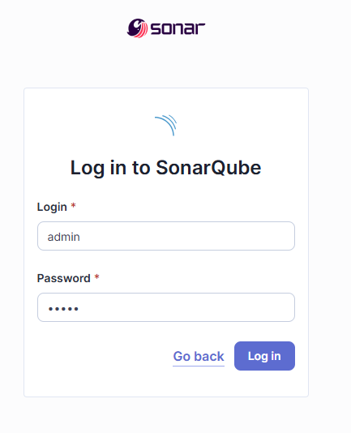

Update to new password: Ex: admin/admin123

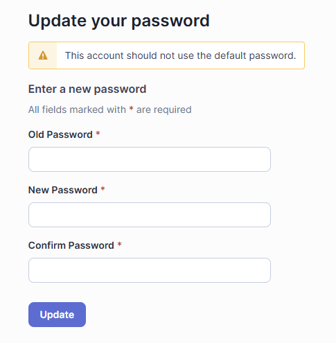

Accept permissions:

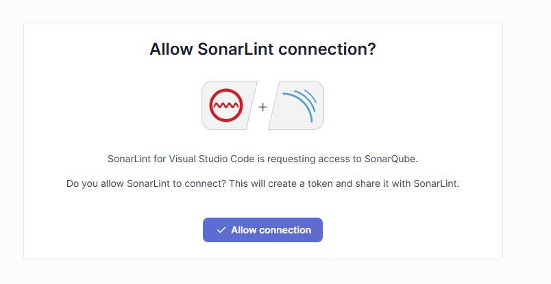

And copy token to place it back on 'User Token' in 'SonarQube Server Connection' extension configuration:

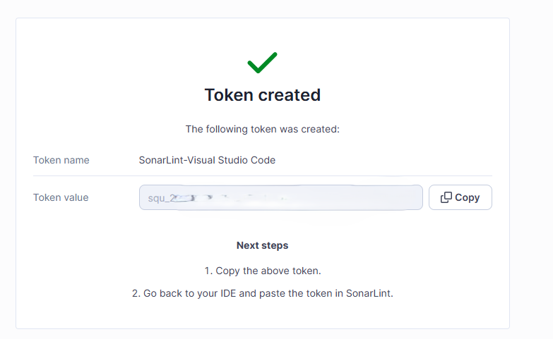

Finally, click on the 'Save Connection' button.

## Create a new SonarQube project

To create a new SonarQube project, go to 'Projects' in the SonarQube instance and click on 'Create a local project':

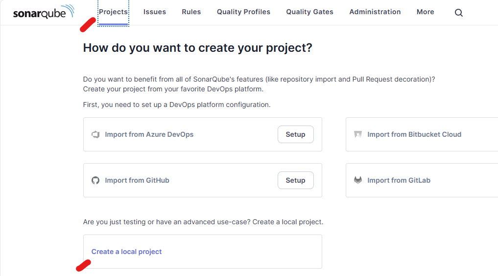

Use demo as the project name and key and click on 'Next':


Finally, set 'Global settings' and click on 'Create project':

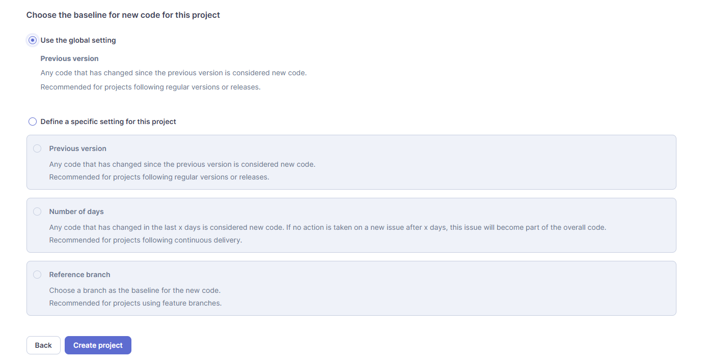

If you want to run the analysis locally, you can obtain the command by clicking on 'Locally':

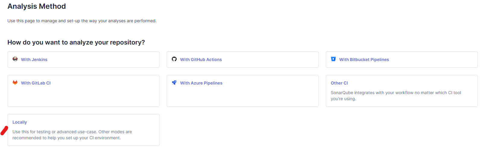

Then, generate a token: 

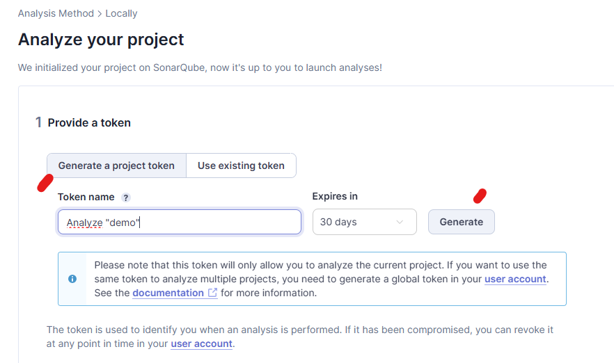

Click on 'Continue':

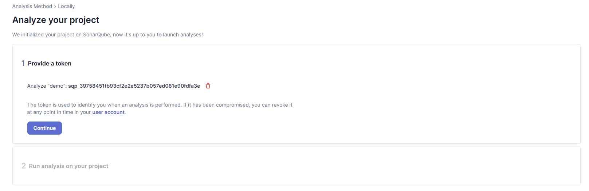

And copy the maven command:

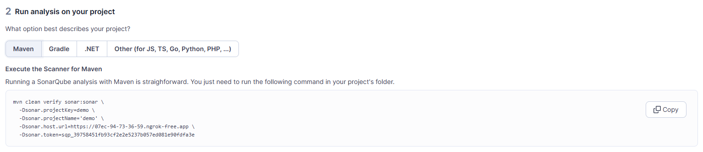

## Bind the project in the connected server

Bind the project in the connected server on the extension side. You can do this by clicking on the '+' icon next to the 'Projects' section in the SonarQube extension:

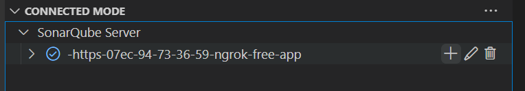 

Then, select the project you created.

## Final result

Once everything has been set up and the analysis has been run, you will see the results in the SonarQube extension in Visual Studio Code. Check the 'Problems' views:

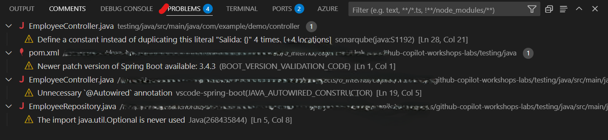

Same results are shown in the SonarQube server:


## Installing SonarQube locally using Docker

To install SonarQube locally using Docker, follow these steps:

```bash
docker run --name sonarqube-custom -p 9000:9000 sonarqube:10.6-community
```

This command will run a SonarQube Community Edition container on your local machine. You can access the SonarQube server by going to http://localhost:9000 in your web browser.

In case you would like to expose it to the network, you can use tools such as [ngrok](https://ngrok.com/) to create a public URL for your local server.

```bash
ngrok http 9000
```


